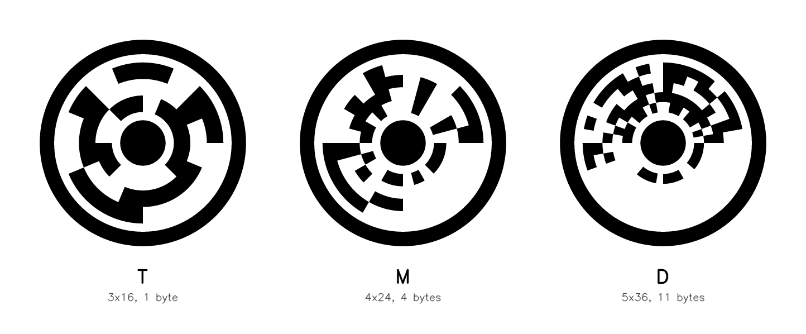
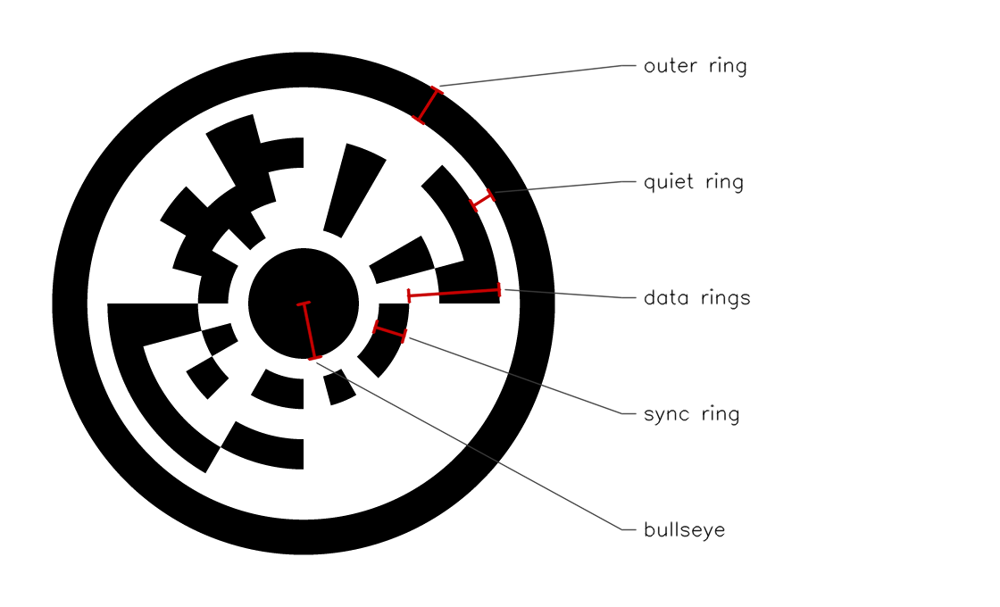
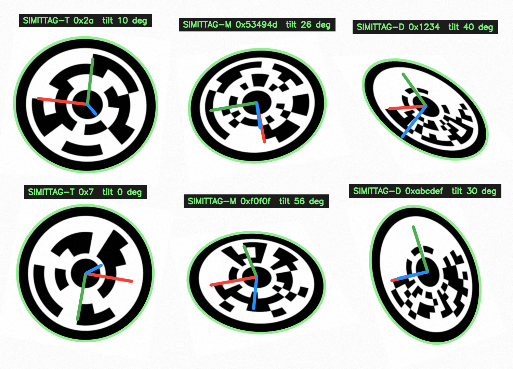
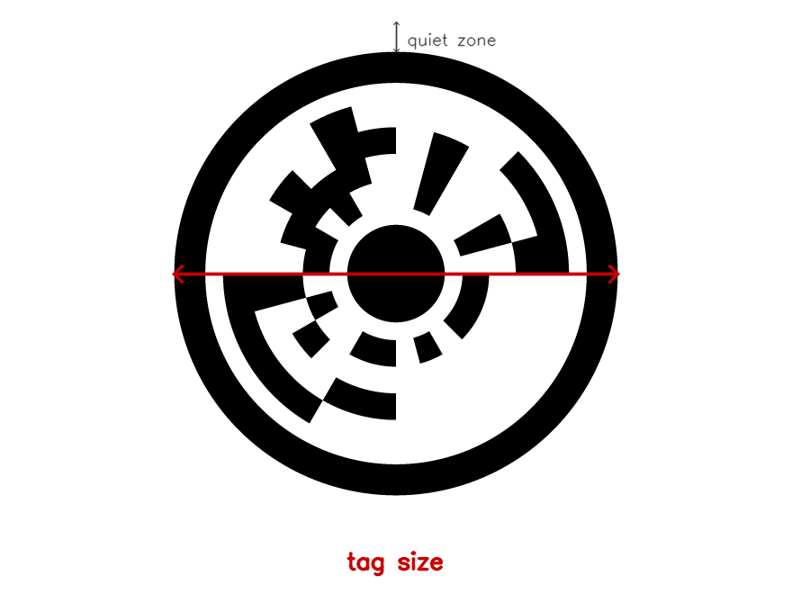

> [!IMPORTANT]
> Simittag is currently quite early and experimental. We would advise to not use simittag for crucial infrastructure.

Simittag
========
[](https://github.com/alfaoz/simittag/actions/workflows/ci.yml)

Simittag is a circular visual fiducial system. Each tag carries a data payload and can be used to estimate the full 6-DoF pose of the camera. This repository contains the Python reference implementation and a Rust port of the detector. The Rust port has no dependencies and also builds to WebAssembly.

Tags come in three default variants. We recommend the s16m variant unless you have a specific reason to choose otherwise.



Table of Contents
=================
- [Overview](#overview)
- [Choosing a Variant](#choosing-a-variant)
- [Install](#install)
- [Usage](#usage)
  - [Generating Tags](#generating-tags)
  - [Getting Started with the Detector](#getting-started-with-the-detector)
    - [Python](#python)
    - [Rust](#rust)
    - [WebAssembly](#webassembly)
  - [Payload Modes](#payload-modes)
  - [Pose Estimation](#pose-estimation)
  - [Calibration](#calibration)
  - [Lens Distortion](#lens-distortion)
- [Performance](#performance)
- [Detection Range](#detection-range)
- [Comparison with Other Fiducial Systems](#comparison-with-other-fiducial-systems)
- [Implementation Notes](#implementation-notes)
- [License](#license)

Overview
========
A Simittag is made of concentric rings. From the center out these are a black bullseye disk, a quiet ring, several rings of data cells, another quiet ring, and a black outer ring. The detector normally finds the outer ring and fits an ellipse to it. If partial occlusion breaks that contour but leaves the bullseye intact, the detector can recover the same projective geometry from the bullseye's known radius. The pose is recovered from that ellipse. The data cells are then sampled in grayscale and decoded with Reed-Solomon error correction. Cells the sampler is not confident about are passed to the decoder as erasures rather than guesses.

Tags may be black on white or inverted white on black, and both polarities can appear in the same frame. Detection results include an `inverted` boolean. The normal black-on-white frontend runs first; the inverted frontend runs only when candidate contrast indicates it is needed, so normal-only scenes keep the original fast path.



The detector never returns unverified data. Every payload is checked against a CRC before it is reported, and a tag that fails the check is simply not reported. There is also no temporal filtering. Every frame is detected on its own.

The innermost data ring holds a fixed synchronization pattern. The tag's rotation is recovered by correlating against this pattern once. The same mechanism lets the detector identify the variant automatically, because the wrong variant's pattern fails to correlate.



Detector output on a test frame. The ellipse, axes, and tilt are drawn from the recovered pose. The labels show the decoded payloads.

Choosing a Variant
==================
The three variants share the same ring layout. Detection and pose estimation are identical for all of them. They differ only in the data grid.

| Variant | Alias | Grid | Payload | Distinct IDs | Corrects |
|:-:|:-:|:-:|:-:|:-:|:-:|
| sim48c12 | s4k | 3×16 | 12-bit ID | 4,096 | 2 errors / 3 erasures |
| sim96c32 | s16m | 4×24 | 4 bytes | 16.7 M | 2 errors / 3 erasures |
| sim180c88 | sdata | 5×36 | 11 bytes | 2⁸⁸ | 3 errors / 5 erasures |

Two more tracking variants share s4k's 3×16 grid and are selected explicitly rather than by default: `sim48c8` (`s256`), the original tracking tag — 256 IDs and about half a meter more range than s4k, with a weaker code (see the caveat below) — and the experimental `sim48c16` (`s64k`) with 65,536 IDs. Deploy at most one 3×16 variant per environment and configure the detector accordingly; the detector accepts any explicit combination (for fleet migrations), and cross-reading between them measured zero in about 280,000 adversarial trials.

Every variant has two interchangeable names: a canonical technical name (`sim<cells>c<payload bits>`) and a short alias. Both are accepted wherever a variant is selected, and detections report both. Earlier releases called these variants T, M, and D; those letters are still accepted as input but are deprecated. Printed tags are unaffected by naming, since tags carry sync patterns, not names.

Some heuristics for choosing:
1. If you need maximum detection distance or expect motion blur, use a 3×16 tracking tag: s4k by default, or s256 (selected explicitly) for the last half meter of range if occasional sub-floor wrong IDs are acceptable.
2. If an ID is not enough and you need text, namespaces, or coordinates, use sdata.
3. Otherwise use s16m.

One caveat on s256: its single payload byte is protected by the weakest code of the family, and below its reliable decode floor a small fraction of reads can return a wrong ID. In our measurements every wrong read happened on tags smaller than about 20 px, where fewer than three quarters of frames decode at all; there, roughly 0.5% of trials (under 1% of successful decodes) returned a wrong ID, and we measured zero wrong reads at 21 px and above in 3,000 trials. s16m and sdata did not produce a single wrong read anywhere, and the experimental s4k variant offers s256-class range with the strongest code of the family. If a wrong ID is worse for your application than a missed detection, prefer s4k or s16m.

The detector identifies the variant automatically among the default set (s4k, s16m, sdata). s256 and s64k are decoded when selected explicitly — pinned alone (faster) or in any explicit set. Pinning to a single variant is always the fastest configuration.

Install
=======
From PyPI:

```
pip install simittag
```

This gives you the detector, the marker generator, camera calibration, and the `simittag` command-line tool. The package depends on NumPy and headless OpenCV. If you need OpenCV's GUI functions, install `opencv-python` alongside it.

Prebuilt Rust CLI binaries for Linux (x86_64 and aarch64), macOS (Apple silicon), and Windows are attached to each GitHub release.

From source, the Python reference implementation requires NumPy and OpenCV:

```
git clone https://github.com/alfaoz/simittag.git
cd simittag
pip install numpy opencv-python
```

The Rust port has no dependencies:

```
cd rust
cargo build --release
```

This builds the `simittag` command-line tool at `rust/target/release/simittag`.

For the WebAssembly build, see [WebAssembly](#webassembly) below.

For ROS 2 (Jazzy), use the [`ros/`](ros/) package in this repository: image and CameraInfo in, `vision_msgs/Detection3DArray` with metric poses and fitted covariance plus TF out. Clone the repository into a colcon workspace and `colcon build --packages-select simittag_ros`.

Usage
=====

## Generating Tags

```
python -m marker.generate --variant s16m --id 0x1234 --out tag.png
python -m marker.generate --variant s16m --id 0x1234 --inverted --out inverted-tag.png
```

`--variant` accepts either name form (`s16m` or `sim96c32`).

There is also a small command-line app (`simittag` when the package is installed, `python app.py` from a source checkout):

```
python app.py encode --id 12345 --out tag.png
python app.py encode --raw "hi" --out tag.png
python app.py decode photo.png
```

The SVG generator in `marker/svg.py` produces the same geometry as the raster generator. It is important to leave a white quiet zone around the outer ring when printing, preferably square, but not necessary for high performance.

## Getting Started with the Detector

### Python

```python
import cv2
from simittag import detect
from simittag.spec import DEFAULT

gray = cv2.imread("frame.png", cv2.IMREAD_GRAYSCALE)
results = detect.detect(gray, DEFAULT)

for r in results:
    print(r["variant"], r["mode"], r["value"], r["center"],
          r["tilt_deg"], r["inverted"])
```

Decoding works without camera calibration. For a metrically correct pose, pass your camera intrinsics as a 3×3 matrix with `K=`.

### Rust

```
./rust/target/release/simittag detect frame.png
```

This prints one JSON line per decoded tag, with the payload, the pose, and the recovered ellipse. Two optional arguments pin the variant and set the assumed horizontal field of view: `simittag detect frame.png s16m 78`. Decoding is robust to the FOV guess; only the pose needs the real value.

You can also use the `simittag-core` crate as a library.

### WebAssembly

```
rust/build-wasm.sh
```

This builds two modules into `rust/dist/`. The `wasm/` module is single-threaded and uses SIMD. The `wasm-mt/` module is multi-threaded. Both expose a `detect` function that takes a grayscale buffer and the camera intrinsics and returns JSON.

The threaded build has unusual requirements. It needs nightly Rust, a rebuilt standard library, explicit shared-memory linker flags, and a cross-origin-isolated page to run on. All of this is documented in the build script. Read its comments before changing anything.

## Payload Modes

An s256 tag holds a single raw byte and nothing else. s16m and sdata tags start with a one-byte header that selects a mode:

* `ID` holds an unsigned integer. This is the default.
* `RAW` holds opaque bytes or short text.
* `TAGGED` holds a namespace byte and an ID, so independent deployments do not collide.
* `GEO` holds latitude, longitude, and altitude. It fits only in an sdata tag. A GEO tag knows its own position, so one detection tells the camera where it is in the world.

Payloads with an unknown mode decode as verified raw bytes. They are never misparsed. There is deliberately no URL mode.

## Pose Estimation

Every decoded detection includes the tag's pose. The translation is expressed in units of the tag's outer-ring radius. Multiply by the physical radius in meters to get metric translation. Tag size is measured across the outer edge of the black outer ring, as shown below.



The camera frame has its origin at the camera center. The z-axis points out of the lens, x is to the right in the image, and y is down. This matches the ROS optical frame convention (REP-103), so the pose drops into a ROS pipeline without a frame conversion. The tag frame is centered on the tag. From the viewer's perspective, x is to the right, y is down, and z points into the tag surface.

An ellipse admits two pose interpretations. This is the circular counterpart of the planar pose ambiguity that square tags have. The detector evaluates both interpretations and picks the one confirmed by the decoded data grid. The two solutions converge as the tag becomes fronto-parallel, so the ambiguity is harmless exactly where it is hardest to distinguish.

Median pose accuracy on realistically degraded synthetic frames, variant s16m, tilts from 0 to 70 degrees: 0.01 to 0.03 degrees of tilt error, 0.07 degrees of full rotation error, 0.04% depth error, and about 0.6 px of center reprojection error.

Pose quality degrades before decoding does. Near the decode floor (tags 22 to 40 px across) the median tilt error grows to about 2 degrees, with a systematic underestimate of up to 3 degrees, because blur rounds the ellipse. If you decode at extreme range, trust the payload more than the tilt.

## Calibration

Metric pose needs camera intrinsics. The Python package solves them from photos of a printed calibration board:

```
simittag calibrate img1.png img2.png ... --out intrinsics.json
```

Print a calibration sheet from the [studio](https://simittag.simitrobotics.com), then photograph it from varied positions and tilts. The solver needs at least 4 usable views with at least 6 board tags visible in each; more views and steeper variety improve the result. Boards are self-describing: each sheet carries a descriptor tag encoding the layout and, on current sheets, the tag variant, so the calibrator configures itself from the photos alone. Generated boards use s4k tags; older sheets carry s256 tags and still calibrate the same way, since the descriptor tells the calibrator which variant to decode. If you kept the studio's JSON sidecar, pass it with `--board`; it is the preferred source of truth and adds one more point per view.

The command reports fx, fy, cx, cy, the OpenCV distortion vector, and the reprojection RMS, and writes them to a JSON file. Feed it back into detection:

```
simittag decode photo.png --intrinsics intrinsics.json
```

or in Python:

```python
from simittag.calibrate import CameraIntrinsics
intr = CameraIntrinsics.load("intrinsics.json")
detect.detect(gray, K=intr.K, dist=intr.dist_array)
```

The intrinsics contract mirrors AprilTag's `apriltag_detection_info_t` (fx, fy, cx, cy in pixels) plus the OpenCV distortion vector, so values from any standard OpenCV calibration are interchangeable with ours.

Calibration is Python-only by design. The Rust detector and the WebAssembly build consume K and dist but do not produce them; the ROS 2 node takes both from CameraInfo, where the standard ROS calibration tooling applies.

## Lens Distortion

The pose math assumes a pinhole camera. Under radial distortion an off-center circle does not project to an ellipse, and the pose becomes biased. The effect is worst with wide lenses and tags near the edge of the frame. Pass your distortion coefficients (from [Calibration](#calibration) above, or any OpenCV calibration) to correct for it:

```python
detect.detect(gray, DEFAULT, K=K, dist=(k1, k2, p1, p2, k3))
```

The frame is undistorted once, with cached maps. With a typical webcam lens and the tag near the frame edge, the uncorrected detector loses 20% of its decodes and misreads rotation by 9.5 degrees. The corrected detector matches the pinhole control.

Performance
===========
Timings for a 1280x1280 frame containing six tags, variant auto-detection on, measured on a modern ARM processor:

| Detector | Time |
|---|---:|
| Rust native (rayon) | ~5 ms |
| WASM, threaded (14 workers) | ~19 ms |
| WASM, single-thread + SIMD | ~23 ms |
| Python reference (OpenCV, 14 threads) | ~65 ms |

These timings are for the default variant set detecting its own tags (s4k, s16m, sdata; the s4k tags decode on the first spec tried). A detector configured for the legacy s256/s16m/sdata set measures about 6 ms native and about 26 ms in single-threaded WASM on the equivalent frame; the threaded WASM build currently gets slower than single-threaded on that configuration (its per-parallel-section overhead outweighs the parallelism when more of the frame time is failed-spec scanning), so single-thread is the safe WASM default when variants beyond the default set are enabled. These timings are for normal black-on-white scenes. White-on-black or mixed-polarity scenes add a second threshold/contour pass; it is triggered from candidate contrast rather than paid on every frame.

Detection Range
===============
Measured with an A4-printed tag (175 mm outer diameter) on a 1080p, 60-degree-HFOV camera, under mild defocus, sensor noise, and JPEG compression, 20 random tags per cell. Range is the farthest distance with at least 90% decode.

| Variant | Range, facing (m) | Range, 25° tilt (m) | Decode floor (px) |
|---|---:|---:|---:|
| s4k | 12.5 | 12 | ~23 |
| s256 | 13 | 13.5 | ~22 |
| s16m | 10 | 9.5 | ~29 |
| sdata | 8.5 | 8 | ~34 |

The decode floor is the smallest outer-ring diameter, in image pixels, that still decodes. Range scales linearly with print size and with camera resolution.

When a small candidate fails to decode, the detector deconvolves the tag patch (Wiener filter against an assumed Gaussian point-spread) and retries. At long range the limit is not finding the tag, since the outer ring is detected far past the decode floor. The limit is inter-symbol interference: defocus bleeds neighboring data cells into each other. Undoing the blur recovers the bits. The retry runs only after a failed decode on a small candidate, so it adds nothing to healthy frames, and every retry result still has to pass the sync, Reed-Solomon, CRC, and decode-verify gates.

The same retry also covers heavy defocus at mid range. Strong blur defeats decoding long before a tag is small, so candidates up to 160 px are retried, with point-spread widths up to 2.4 px. At a defocus of sigma 2.0 on the A4 test rig this raises the 90%-decode range of s16m from 2.6 m to 5.0 m and of sdata from 2.5 m to 3.9 m, with s256 improving from 6.0 m to 6.9 m.

Two more retries follow the same pattern. Under motion blur the point-spread is a line, not a Gaussian. When a failed candidate shows directional smear, measured by structure-tensor coherence, the detector deconvolves a line PSF along the estimated blur axis and retries; this roughly doubles the tolerated smear length (on a 180 px tag, s16m decodes through 30 px of smear instead of 18, sdata through 24 instead of 12, s256 through about 40 instead of 30). Under a hard shadow edge the global black/white reference pair misclassifies the shadowed half of the grid; a final retry rethresholds every cell against an illumination plane fitted to the tag's own quiet rings, which restores decoding under half-plane shadows down to 0.3x brightness. Both retries run only on failures and pass the same accept gates, and the 600-frame clutter measurement above is unchanged with them enabled.

Occlusion is handled by geometry rather than deconvolution. When an occluder breaks the outer-ring contour, the intact bullseye is fitted as its own candidate and recovers the same projective geometry after scaling by its known radius. Small lone disks, down to a fitted radius of 4 px, are admitted into this fallback only, so normal frames pay nothing for it. Measured with a straight-edge occluder on the A4 rig: a 96 px s16m tag decodes through 20% occlusion in 56 of 60 trials and through 30% in 44 of 60; at 64 px the rates are 29, 15, 9, and 5 of 60 at 5, 10, 15, and 20% occlusion. On the same frames AprilTag and ArUco stop detecting at 5% occlusion. Below about 55 px the bullseye ellipse is too small to carry the data grid, and occlusion tolerance ends.

### The 3×16 tracking variants: s4k, s256, and s64k

Three tracking variants share one 3×16 grid and print geometry. `sim48c12` (`s4k`, the default) and the experimental `sim48c16` (`s64k`) carry Reed-Solomon nibbles over GF(16) with a 4-bit CRC; `sim48c8` (`s256`) is the original byte-code tag.

| Variant | Alias | Payload | Distinct IDs | Corrects | Range, 15° tilt (m) | Decode floor (px) | Wrong IDs measured |
|:-:|:-:|:-:|:-:|:-:|---:|---:|:-:|
| sim48c12 | s4k | 12-bit ID | 4,096 | 2 errors / 3 erasures | 12.6 | ~23 | 0 in ~17k trials |
| sim48c8 | s256 | 1 byte | 256 | 1 error | 13.3 | ~22 | ~0.5% of sub-floor trials only |
| sim48c16 | s64k | 16-bit ID | 65,536 | 1 error / 2 erasures | 12.2 | ~24 | 0 in ~17k trials |

s4k is the default: 16× s256's ID space, the strongest code of the family, and zero wrong IDs in every condition we measured, for about half a meter of range at small tilts (more under heavy blur, where s256's larger per-symbol cells hold on longer). s256 remains the maximum-range choice, selected explicitly; s64k is the high-capacity option (AprilTag 36h11, for comparison, has 587 IDs) and remains experimental.

Because all three share one grid, telling them apart rests on their synchronization patterns and codecs rather than on geometry. The patterns were chosen jointly for worst-case cross-correlation margin, and the nibble variants carry a raised decode-verify floor (0.78 instead of the global 0.73). We measured the cross-rejection directly: across roughly 280,000 trials of each same-grid variant's tags against the others' decoders — sizes from 16 px to 128 px, both polarities, degradations up to heavy defocus with strong noise — zero cross-decodes. The 600-frame clutter suite also remains at zero false positives with all five variants enabled.

Deploy at most one 3×16 variant per physical environment and configure the detector to match. The default auto set decodes s4k; a detector pointed at s256 or s64k tags selects them explicitly (`versions="s256"` in Python, `s256` on the CLI, the `variant` parameter in ROS). Explicit multi-variant sets are supported for fleet migrations. Calibration boards follow the fleet: generated boards carry s4k tags, and the calibrator reads each sheet's descriptor tag to decode whatever variant that sheet carries, so older s256 sheets keep calibrating unchanged.

Two accept gates guard the search. A sync-ring correlation gate filters non-tag grids before Reed-Solomon runs. After any successful decode, the observed grid is correlated against the re-encoded decoded pattern (a matched filter of the image against what was decoded) and the result is rejected below 0.73. In calibration, correct decodes scored at least 0.807. Across 600 procedurally generated ring-like clutter frames, CRC-valid wrong-decode candidates scored at most 0.673 and none passed the gate. This leaves a measured empty interval between false and correct candidates while preserving margin for degraded real tags.

Comparison with Other Fiducial Systems
======================================
We did some head-to-head testing against AprilTag (tag36h11, via `pupil-apriltags`, full resolution) and ArUco (6x6, DICT_6X6_250, via OpenCV's `cv2.aruco` with default detector parameters) with identical print size, camera model, poses, and image degradation, at 15 degrees of tilt. Range is the farthest distance with at least 90% decode of an A4-printed tag:

| Camera width | Simittag s4k | Simittag s256 | Simittag s16m | Simittag sdata | AprilTag 36h11 | ArUco 6x6 |
|---|---:|---:|---:|---:|---:|---:|
| 1280 px | 8.4 m | 8.9 m | 6.7 m | 5.6 m | 9.6 m | 10.0 m |
| 1920 px | 12.6 m | 13.3 m | 10.0 m | 8.5 m | 14.4 m | 15.0 m |

Detection speed on the same machine (Apple M4 Pro, 14 threads), one 1280x1280 frame containing six of each system's own tags at comparable pixel sizes, same degradation, every detector multithreaded and at full resolution:

| Detector | Time | Relative |
|---|---:|---:|
| Simittag (Rust native) | 6.3 ms | 100% |
| AprilTag (`pupil-apriltags`) | 5.3 ms | 84% |
| ArUco (OpenCV) | 3.0 ms | 47% |

DataMatrix and QR codes store more bytes in the same area, because squares tile and rings do not. They provide no pose.

Implementation Notes
====================
It's advised that the Rust detector is used in production. The Python package defines the correct behavior of the format and the detector, and exists for reference, experimentation, and regenerating the test fixtures.

The two implementations are held together by the fixtures in `fixtures/`: golden vectors and rendered frames exported from the Python reference, which the Rust port must reproduce exactly, bit-for-bit for the codec and imaging stages and to identical decode decisions on every frame. `./check.sh` builds everything and runs the full contract (Rust unit tests, all six parity gates, and the Python self-tests); CI runs the same script on every push.

License
=======
Simittag is licensed under the [BSD 2-Clause License](LICENSE). The Rust ellipse-fitting routine is derived from OpenCV; see [THIRD-PARTY-NOTICES.md](THIRD-PARTY-NOTICES.md).

The tag format is free for anyone to implement.
